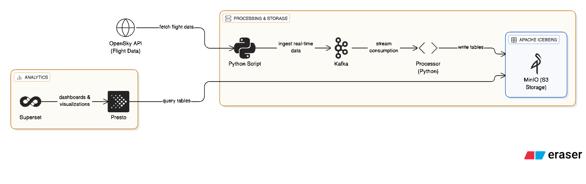

# ARCHITECTURE

# TOOLS

| Tool                | Purpose                                 |
| ------------------- | --------------------------------------- |
| Presto              | Query engine for Iceberg tables         |
| Iceberg             | Table format (like SQL tables on files) |
| Kafka               | Ingest streaming flight data            |
| MinIO               | Local S3-compatible storage             |
| Python              | Script to fetch OpenSky API data        |
| Superset            | Dashboard Visualization                 |
| Docker + Kubernetes | Local setup using Minikube              |
| kubectl             | Manage your Kubernetes cluster          |
| Helm                | Package manager for Kubernetes services |
