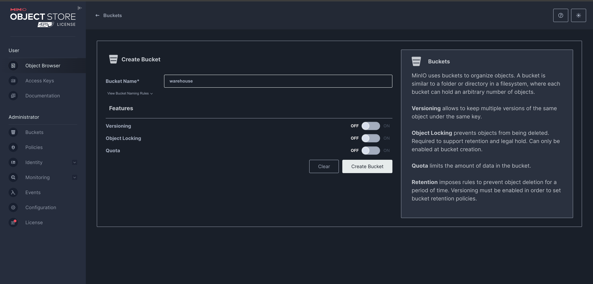

# Setup Minio (S3 backend for iceberg)

We use `helm` as a package manager to download kubernetes templates and deploying them. These templates are called `charts` in helm and can be customized using values.yaml file.
`Note:` If helm is not installed, please install it.

Add Minio helm chart repository

```
helm repo add minio https://charts.min.io/
```

Update the helm repo to fetch latest version

```
helm repo update
```


Before, deploying minio, let us create a folder inside the minikube VM. This folder is then mounted into the minio container which exports the stored data from inside the container to the outside VM.

Create a folder in your VM named `/var/minio-data`.

```
sudo mkdir -p /var/minio-data
```

Give appropriate permissions for user ID 1000 and group ID 1000 which minio uses.

```
sudo chown -R 1000:1000 /var/minio-data
```


Let's separate out the deployments into different namespaces. Create a new namespace named `minio`

```
kubectl create namespace minio
```

Now, we will create a Persistent Volume and Persistent Volume Claim of 100GB to store our data inside the VM.

`minio-hostpath-pv-pvc.yaml`:

```
apiVersion: v1
kind: PersistentVolume
metadata:
  name: minio-hostpath-pv
  labels:
    app: minio
spec:
  capacity:
    storage: 100Gi
  accessModes:
    - ReadWriteOnce
  persistentVolumeReclaimPolicy: Retain
  storageClassName: ""
  hostPath:
    path: /var/minio-data             # <-- this is inside the Minikube VM (the mount target)
---

apiVersion: v1
kind: PersistentVolumeClaim
metadata:
  name: minio-data-pvc
  namespace: minio
spec:
  accessModes:
    - ReadWriteOnce
  resources:
    requests:
      storage: 100Gi
  storageClassName: ""
  volumeName: minio-hostpath-pv
```

Deploy the above PV and PVC.

```
kubectl apply -f minio-hostpath-pv-pvc.yaml
```

Verify the PV and PVC. Make sure our PVC `minio-data-pvc` is `BOUND` to the PV `minio-hostpath-pv`.

```
kubectl get pv
```

```
kubectl get pvc -n minio
```


Install minio

Create a file named `minio-values.yaml` and paste the following content into it.

`minio-values.yaml`:

```
mode: standalone
persistence:
  enabled: true
  existingClaim: minio-data-pvc
  mountPath: /export                 # MinIO writes here in the container

environment:
  MINIO_TMPDIR: /export/tmp
  MINIO_PROMETHEUS_AUTH_TYPE: public

extraInitContainers:
  - name: fix-perms
    image: busybox:1.36
    command:
      - sh
      - -c
      - |
        mkdir -p /export/tmp && chown -R 1000:1000 /export /export/tmp
    volumeMounts:
      - name: export
        mountPath: /export

podSecurityContext:
  runAsUser: 1000
  runAsGroup: 1000
  fsGroup: 1000
  fsGroupChangePolicy: "OnRootMismatch"
resources:
  requests:
    cpu: 100m
    memory: 512Mi
```

Install minio using the below command.

```
helm install minio minio/minio -n minio --set rootUser=minio --set rootPassword=minio123 -f minio-values.yaml
```


Wait for the pods to be up and running.

```
kubectl get all -n minio
```


Open up the `minio` console in a new terminal and keep it running

```
minikube service minio-console --namespace minio
```


Login into Minio (http://localhost:54940 in my case)

Username: 
```
minio
```

Password: 
```
minio123
```


Create `accesskey` and `secretkey` in minio. These are later used by Presto client to connect to minio. Give meaningful name and description in the below dialog box.

accessKey:
```
minioadmin
```

secretKey:
```
minioadmin
```


Finally, create a new bucket named `warehouse`.




Since we are using `hadoop` catalog type in presto, we need an absolute path to a folder inside the bucket. Therefore, create a new folder named `iceberg-data` for the iceberg catalog.

`Note:` To create a folder in minio UI, first create a new path (iceberg-data) and then upload a temp file since minio does not entertain empty folders.


After creating upload a dummy file (values.yaml) to sustain the folder structure.


Let us verify the minikube VM data folder that we created at /var/minio-data to see if the bucket and the corresponding values.yaml that we uploaded have been reflected from inside the container to the VM.

Open a new terminal and run below command to check if the newly created bucket warehouse is present or not in the VM.

Pod's /export dir ---> VM's /var/minio-data directory.

```
minikube ssh
```

```
cd /var/minio-data
```

```
ls
```


As you can see, the warehouse bucket is visible inside the VM. Hence the data is mounted properly.

# Not Required now

Later, we can copy the minio data from VM to our host system before stopping the minikube service.

Get the minikube node container ID

```
CID=$(docker ps --filter "name=minikube" --format "{{.ID}}")
```

Copy the VM path to your Mac folder

```
mkdir -p "$HOME/minio-data-copy"
```

```
docker cp "$CID:/var/minio-data" "$HOME/minio-data-copy"
```

