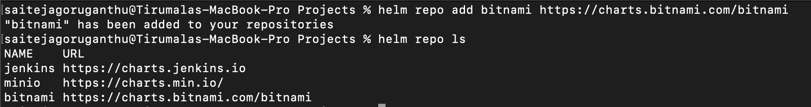
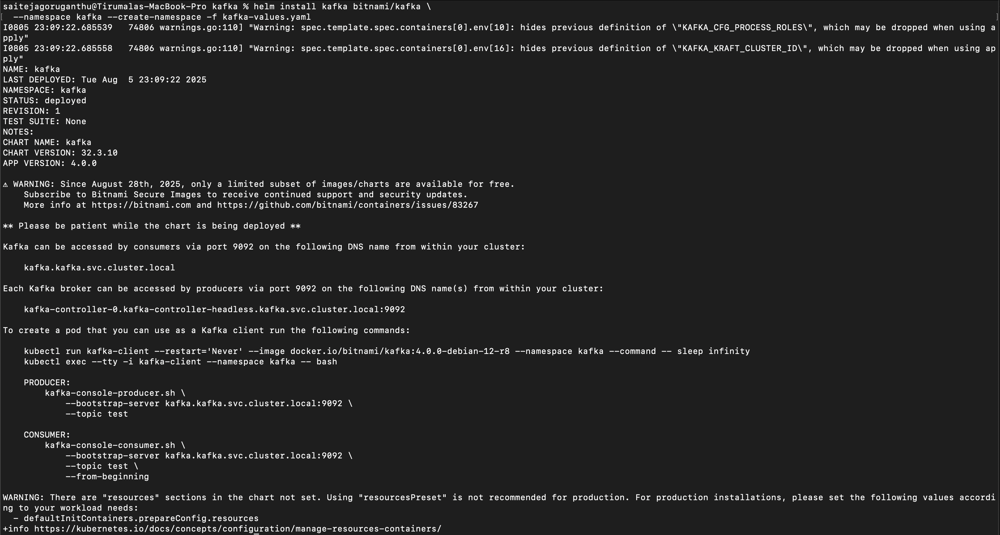
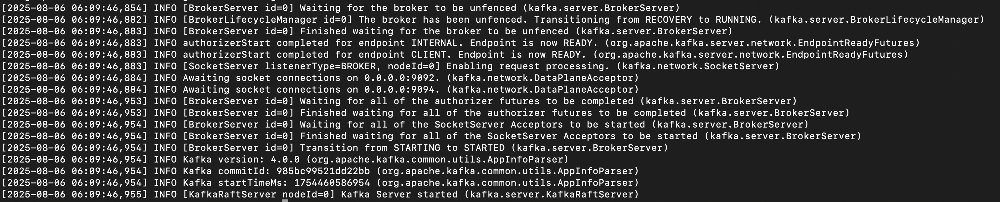

# Setup Apache Kafka in the Minikube Cluster

Add Kafka helm chart repository

```
helm repo add bitnami https://charts.bitnami.com/bitnami
```

Update the helm repo to fetch latest version

```
helm repo update
```



Create `kafka` namespace

```
kubectl create namespace kafka
```

Install Helm repo for kafka

```
helm install kafka bitnami/kafka --namespace kafka --create-namespace -f kafka-values.yaml
```



`kafka-values.yaml` file content is below

```
replicaCount: 1
listeners:
  client:
    protocol: PLAINTEXT
advertisedListeners:
  - name: PLAINTEXT
    advertisedListener: PLAINTEXT://kafka.kafka.svc.cluster.local:9092
controller:
  replicaCount: 1
  resources:
    requests:
      cpu: 200m
      memory: 512Mi
    limits:
      cpu: 300m
      memory: 768Mi
  configurationOverrides:
    controller.quorum.voters: "0@kafka-controller-0.kafka-controller-headless.kafka.svc.cluster.local:9093"
  listenerNames:
    - PLAINTEXT
  extraEnvVars:
    - name: KAFKA_CFG_PROCESS_ROLES
      value: "controller,broker"
    - name: KAFKA_CFG_NODE_ID
      value: "0"
    - name: KAFKA_CFG_CONTROLLER_LISTENER_NAMES
      value: "CONTROLLER"
    - name: KAFKA_CFG_LISTENERS
      value: "PLAINTEXT://:9092,CONTROLLER://:9093"
    - name: KAFKA_CFG_ADVERTISED_LISTENERS
      value: "PLAINTEXT://kafka.kafka.svc.cluster.local:9092"
    - name: KAFKA_CFG_LISTENER_SECURITY_PROTOCOL_MAP
      value: "CONTROLLER:PLAINTEXT,PLAINTEXT:PLAINTEXT"
    - name: KAFKA_KRAFT_CLUSTER_ID
      value: "mkc-abcdef1234567890"
volumePermissions:
  enabled: true
persistence:
  enabled: true
  size: 5Gi
```

Check if the kafka service is started

```
kubectl get all -n kafka
```

Verify the logs of the pod, it should say `Kafka Server Started`

```
kubectl logs kafka-controller-0 -n kafka
```


