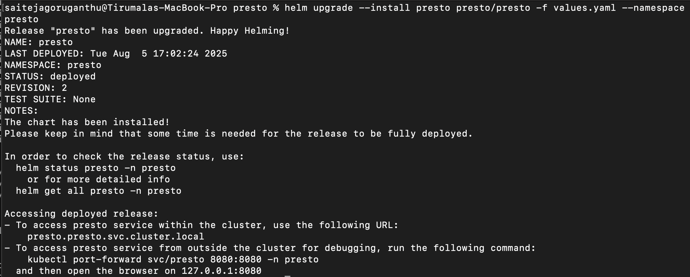
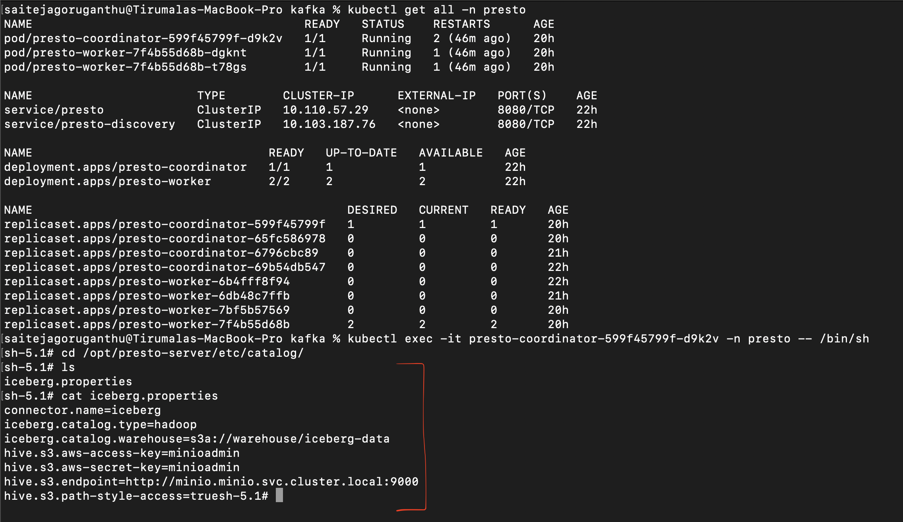
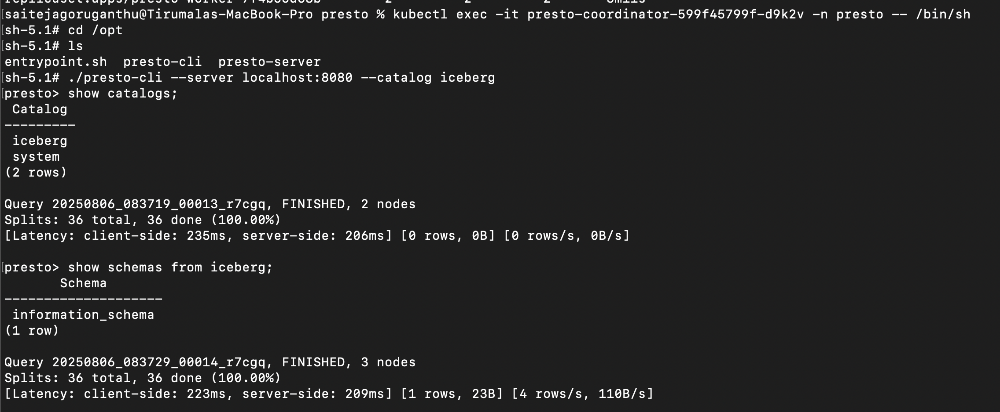
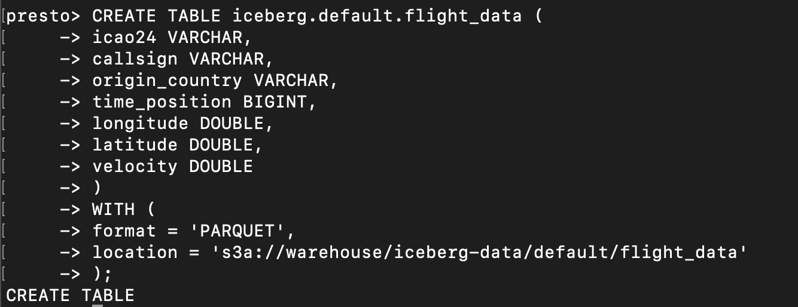
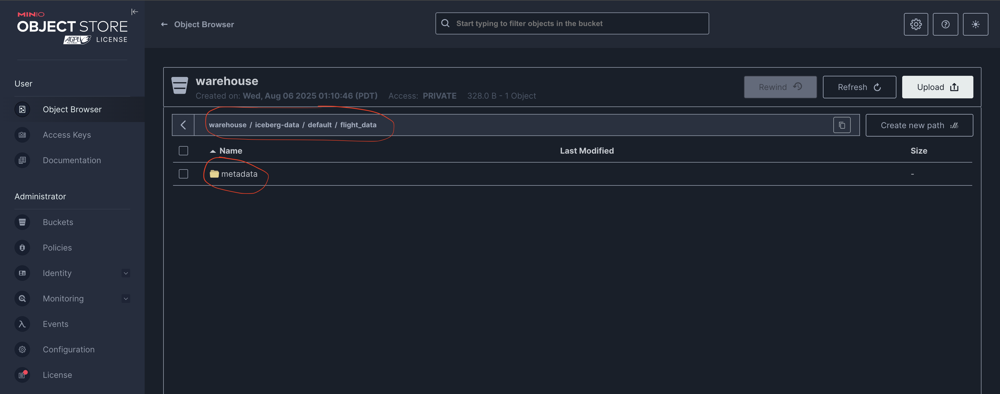
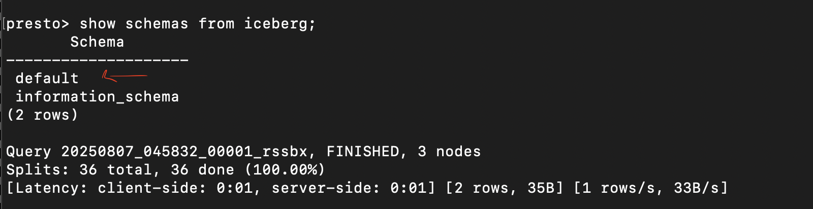

# Configure Presto to use Iceberg Connector

Create a folder named `presto` in your local system.

```
mkdir presto
```

Create `values.yaml` file in that directory.

```
touch values.yaml
```

Add below content in the `values.yaml` file.

```
config: |-
    join-distribution-type=AUTOMATIC
    optimizer.join-reordering-strategy=AUTOMATIC
catalog:
  iceberg: |-
      connector.name=iceberg
      iceberg.catalog.type=hadoop
      iceberg.catalog.warehouse=s3a://warehouse/iceberg-data
      hive.s3.aws-access-key=minioadmin
      hive.s3.aws-secret-key=minioadmin
      hive.s3.endpoint=http://minio.minio.svc.cluster.local:9000
      hive.s3.path-style-access=true
```

Since we need to update the presto deployment, we use helm upgrade command to achieve that.

Run the below command to upgrade the helm installation of presto by adding new catalog properties.

```
helm upgrade --install presto presto/presto -f values.yaml --namespace presto
```



Verify it is upgraded by going into the coordinator pod and look for `iceberg.properties` under `etc/catalog` directory.

First get all pods from presto namespace and find the coordinator pod name. Use it in `kubectl exec` command.

```
kubectl get all -n presto
```

```
kubectl exec -it presto-coordinator-599f45799f-d9k2v -n presto -- /bin/sh
```


As shown above, the catalog properties file is updated.

Now, that we have connected presto to minio, lets create a new iceberg table named `flight_data` in the minio bucket path named `warehouse/iceberg-data` that we created previously.

We use `presto-cli` to test some commands

`presto-cli` is available in the coordinator pod. So, inside the coordinator, execute the below SQL statement.

```
kubectl exec -it presto-coordinator-599f45799f-d9k2v -n presto -- /bin/sh
```

```
cd /opt
```

```
./presto-cli --server localhost:8080 --catalog iceberg
```

```
show catalogs;
```

```
show schemas from iceberg;
```



Now, let's create a new iceberg table named `flight_data` using the `default` schema. Execute the below SQL statement in the presto-cli

```
CREATE TABLE iceberg.default.flight_data (
icao24 VARCHAR,
callsign VARCHAR,
origin_country VARCHAR,
time_position BIGINT,
longitude DOUBLE,
latitude DOUBLE,
velocity DOUBLE  
)  
WITH (
format = 'PARQUET',
location = 's3a://warehouse/iceberg-data/default/flight_data'  
);
```



After table is created, you can visit minio UI to see the reflected table with metadata folder.



As you can see, it has created a new folder named `default` for the schema. You can verify it by executing below command.

```
show schemas from iceberg;
```


