# Copy all the files

Now that table is created, we need to insert data into the table. To achieve this, we use Apache kafka and python.

Create a folder named `kafka` in your local.

```
mkdir kafka
```

Copy all files below into the `kafka` folder.

`opensky_producer.py`:

This script connects to Kafka broker using Kafka Producer object. It polls the `open-sky` API 10 times every 30 seconds to retrieve 100 records each time. Hence, we are expected to have 10x100 = `1000 rows` in our iceberg table. The message is formed and sent to the Kafka topic named `opensky-topic-3`.

```
from kafka import KafkaProducer
import json
import requests
import time
import os
# Get Kafka broker from environment variable or use default
KAFKA_BROKER = os.environ.get('KAFKA_BROKER', 'kafka.kafka.svc.cluster.local:9092')
print("Connecting to Kafka broker:", KAFKA_BROKER)
# Connect to Kafka
producer = KafkaProducer(
    bootstrap_servers=KAFKA_BROKER,
    value_serializer=lambda v: json.dumps(v).encode('utf-8')
)
# OpenSky API endpoint
url = "https://opensky-network.org/api/states/all"
# Limit to 10 API calls total
for i in range(10):
    response = requests.get(url)
    if response.status_code == 200:
        data = response.json()
        count = 0
        for state in data.get("states", []):
            if count >= 100:
                break
            message = {
                "icao24": state[0],
                "callsign": state[1] or "",
                "origin_country": state[2],
                "time_position": state[3],
                "longitude": state[5],
                "latitude": state[6],
                "velocity": state[9]
            }
            producer.send("opensky-topic-3", message)
            print(f"{count}: Sent:", message)
            count += 1
    else:
        print(f"API call failed with status code {response.status_code}")
    print(f"Waiting 30 seconds before next API call ({i+1}/10)...")
    time.sleep(30)
print("Done! Sent 1000 messages in 10 API calls.")
```

`Dockerfile.producer`:

The dockerfile to build the producer image.

```
FROM python:3.10

WORKDIR /app
COPY opensky_producer.py .

RUN pip install kafka-python requests

CMD ["python", "opensky_producer.py"]
```

`opensky-producer.yaml`:

We create a Kubernetes `Job` instead of a pod because we don't want the producer to fetch the data again and again. A kubernetes job object is perfect for this usecase.

```
apiVersion: batch/v1
kind: Job
metadata:
  name: opensky-producer
  namespace: scripts
spec:
  template:
    spec:
      containers:
        - name: opensky-producer
          image: opensky-producer:latest
          imagePullPolicy: Never
          env:
            - name: KAFKA_BROKER
              value: kafka.kafka.svc.cluster.local:9092
      restartPolicy: Never
  backoffLimit: 0
```

`presto_insert.py`:

This python script uses Kafka consumer object to consume the messages from the kafka topic written by the producer and insert them one-by-one into the iceberg table `flight-data` using presto-python-client.

```
from kafka import KafkaConsumer
from prestodb import dbapi
import json
import os

KAFKA_BROKER = os.environ.get('KAFKA_BROKER', 'kafka.kafka.svc.cluster.local:9092')
PRESTO_HOST = os.environ.get('PRESTO_HOST', 'presto.presto.svc.cluster.local')
print("Connecting to Kafka broker: ", KAFKA_BROKER)
print("Connecting to Presto: ", PRESTO_HOST)

# Connect to Kafka
consumer = KafkaConsumer(
    'opensky-topic-3',
    bootstrap_servers=KAFKA_BROKER,
    value_deserializer=lambda m: json.loads(m.decode('utf-8')),
    auto_offset_reset='earliest',
    enable_auto_commit=True
)

# Connect to Presto inside cluster
conn = dbapi.connect(
    host=PRESTO_HOST,
    port=8080,
    user='admin',
    catalog='iceberg',
    schema='default'
)
cursor = conn.cursor()
print(conn)

# Loop to read from Kafka and insert into Iceberg
for message in consumer:
    print("Message: ", message)
    data = message.value
    callsign = data["callsign"].replace("'", "''")
    country = data["origin_country"].replace("'", "''")
    insert_sql = f"""
    INSERT INTO flight_data (
        icao24, callsign, origin_country, time_position,
        longitude, latitude, velocity
    )
    VALUES (
        '{data["icao24"]}', '{callsign}', '{country}', {data["time_position"]},
        {data["longitude"]}, {data["latitude"]}, {data["velocity"]}
    )
    """
    try:
        cursor.execute(insert_sql)
        print("Inserted:", data["icao24"])
    except Exception as e:
        print("Error inserting:", e)
```

`Dockerfile.consumer`:

The dockerfile to build the consumer image.

```
FROM python:3.10

WORKDIR /app
COPY presto_insert.py .

RUN pip install kafka-python presto-python-client

CMD ["python", "presto_insert.py"]
```

`presto-consumer.yaml`:

We deploy a consumer pod using the yaml below.

```
apiVersion: apps/v1
kind: Deployment
metadata:
  name: presto-consumer
spec:
  replicas: 1
  selector:
    matchLabels:
      app: presto-consumer
  template:
    metadata:
      labels:
        app: presto-consumer
    spec:
      containers:
      - name: consumer
        image: presto-consumer:latest
        imagePullPolicy: Never
        env:
        - name: KAFKA_BROKER
          value: kafka.kafka.svc.cluster.local:9092
        - name: PRESTO_HOST
          value: presto.presto.svc.cluster.local
```

Build Docker Images

Let us use minikube docker env:

```
eval $(minikube docker-env)
```

```
docker build -t opensky-producer:latest -f Dockerfile.producer .
```

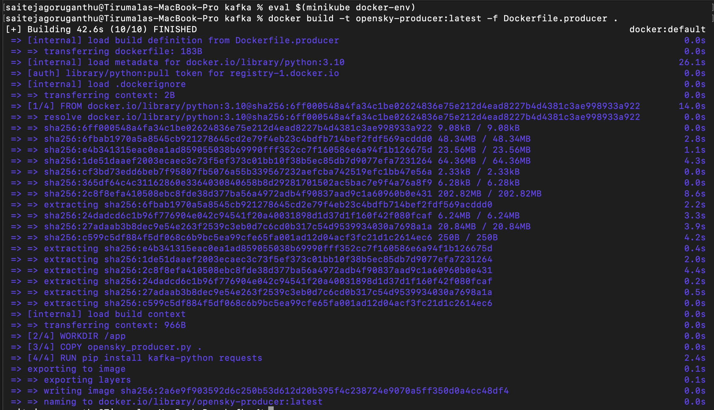

An image named `opensky-producer:latest` has been created in minikube docker environment.

Repeat the same for consumer.

```
docker build -t presto-consumer:latest -f Dockerfile.consumer .
```

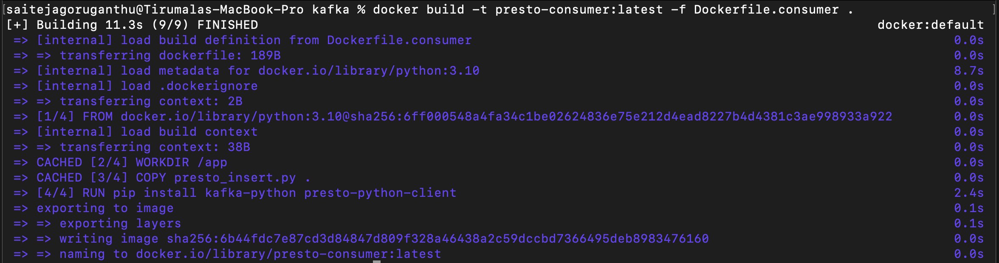
An image named `presto-consumer:latest` has been created in minikube docker environment.

Verify that the images are created

```
docker image ls
```

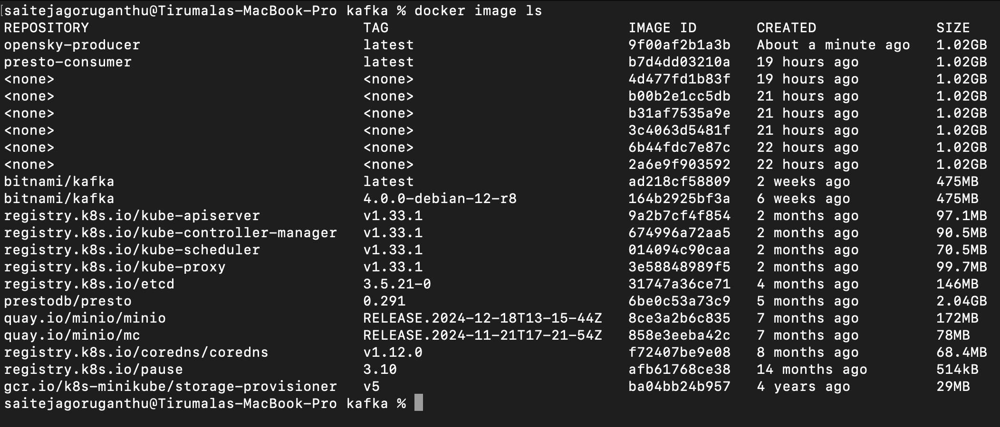

Now that we have docker images, lets deploy in the minikube cluster using kubernetes objects (opensky-producer.yaml, presto-consumer.yaml).

Create a new namespace for these scripts

```
kubectl create ns scripts
```

```
kubectl apply -f opensky-producer.yaml -f presto-consumer.yaml -n scripts
```

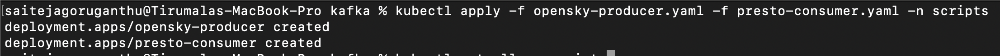

Verify the Producer Job and Consumer pod is running

```
kubectl get all -n scripts
```

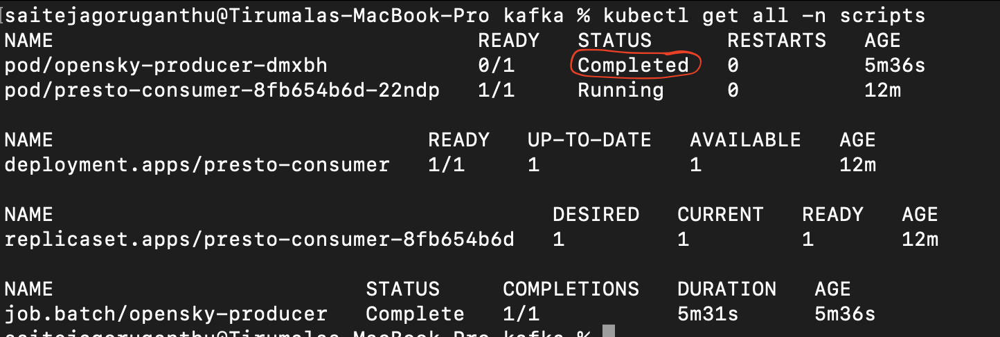

As you can see, the producer job status is Completed, which means the API has been called 10 times and 3000 messages have been sent to the kafka topic by the kafka producer.

Verify the producer logs to check if the messages have been sent

```
kubectl logs opensky-producer-5ddb4d775b-q2625 -n scripts
```

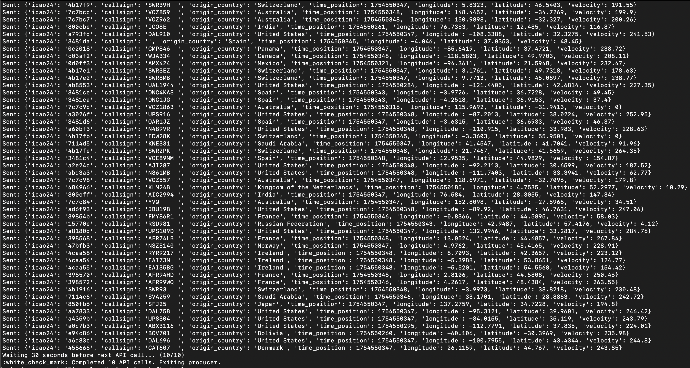

Similarly verify the consumer logs to check if the messages have been inserted by presto

```
kubectl logs presto-consumer-8fb654b6d-krrj4 -n scripts
```

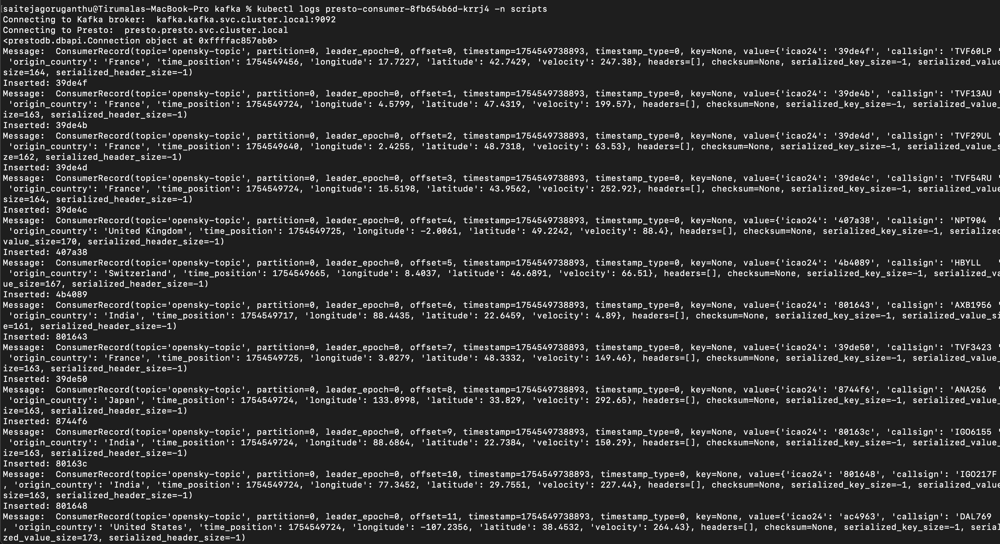

Check the queries running live by accessing the presto UI.

You can access `Presto UI` that is running inside your cluster by port-forwarding it to `localhost:8080` using below command.
Open a new terminal and run:

```
kubectl port-forward svc/presto 8080:8080 -n presto
```

Open http://localhost:8080 in your browser to access the presto UI.

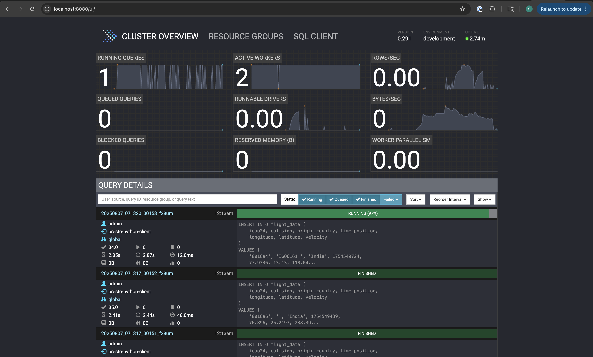

As shown, the insert statements are running.

Sometimes, the `localhost:8080` loses connection to pod since the pod crashes due to heavy load. But, thanks to kubernetes, it automatically restarts and starts running the queries again in backend. To view them in the presto UI, start the port-forwarding command again. Open the http://localhost:8080 to continue looking at live query execution.
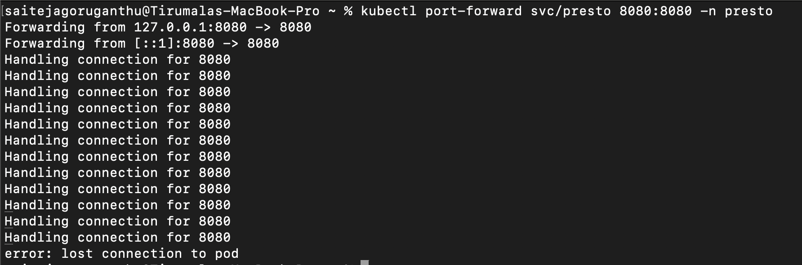

After reconnecting,

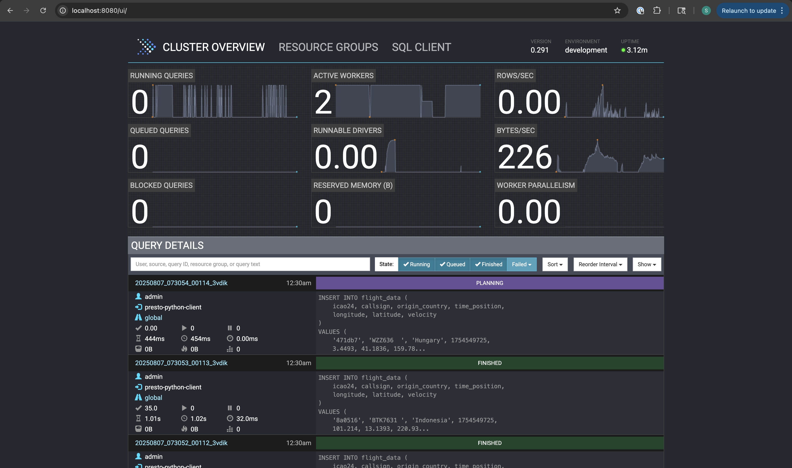

Lets now look at storage layer (`minio`) to see the inserted data.

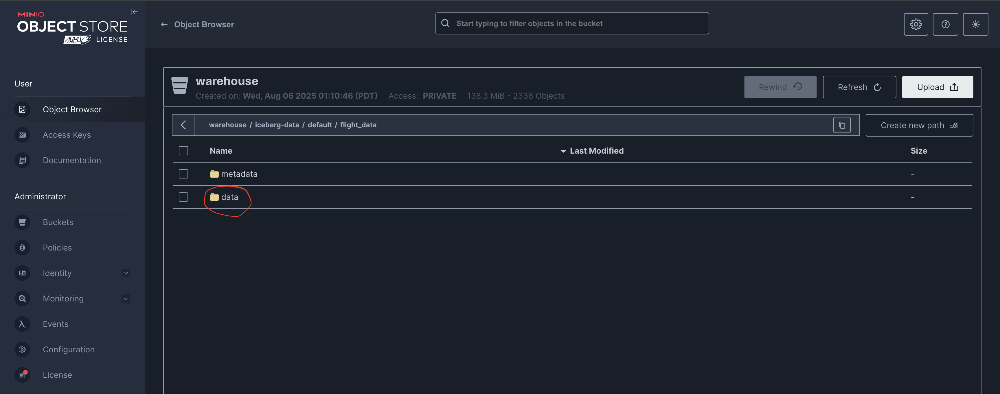
As shown, the `data` folder appears after insertions take place. The data folder contains the parquet files that have been written.

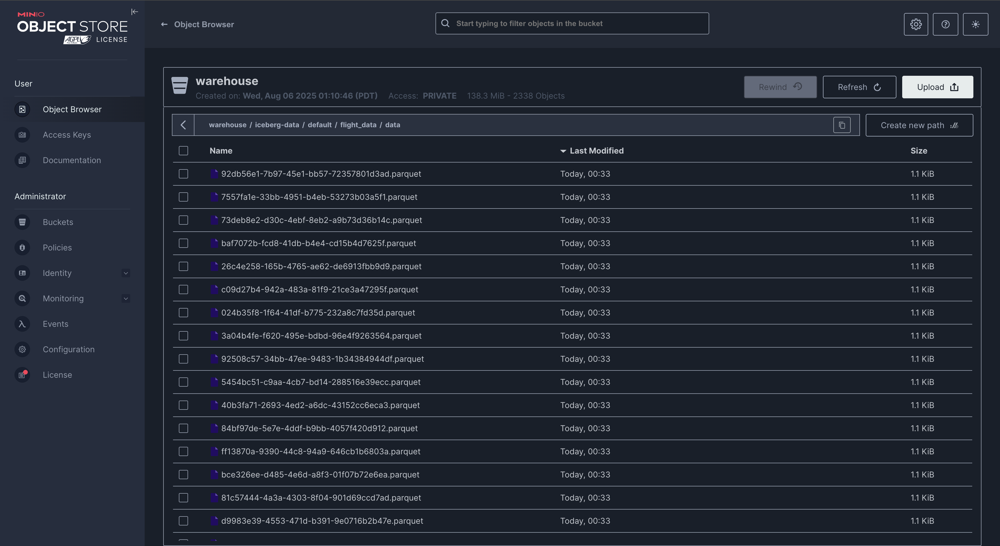

Also, take a look at the `metadata` folder that stores the metadata related to schema, tables, etc.

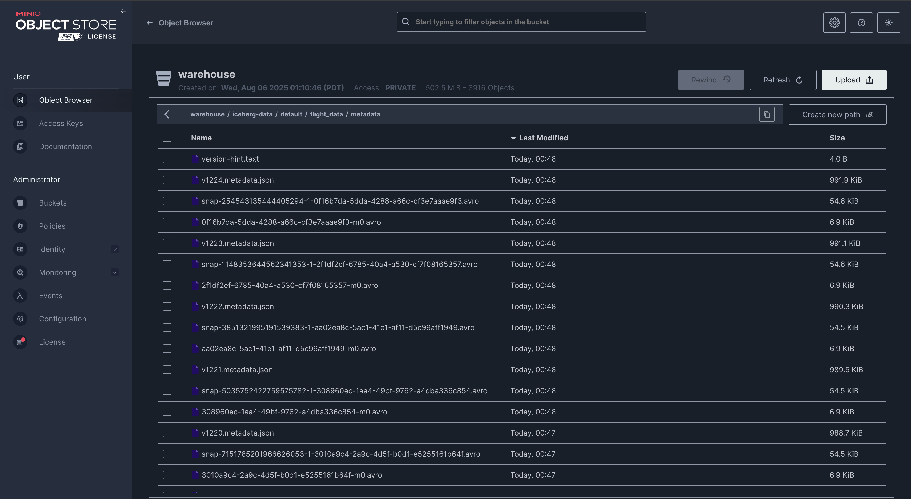

Since we are not using enough resources, the cluster might get stuck. Simply restart the consumer pod.

```
kubectl rollout restart deployment presto-consumer -n scripts
```
