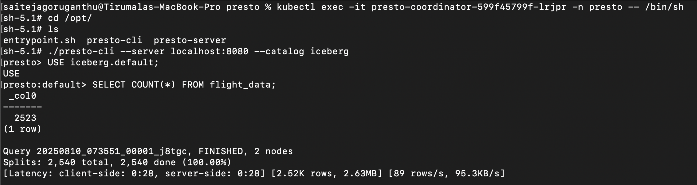
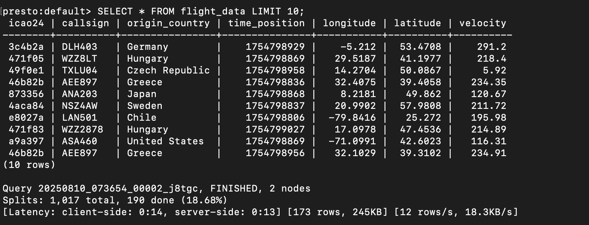
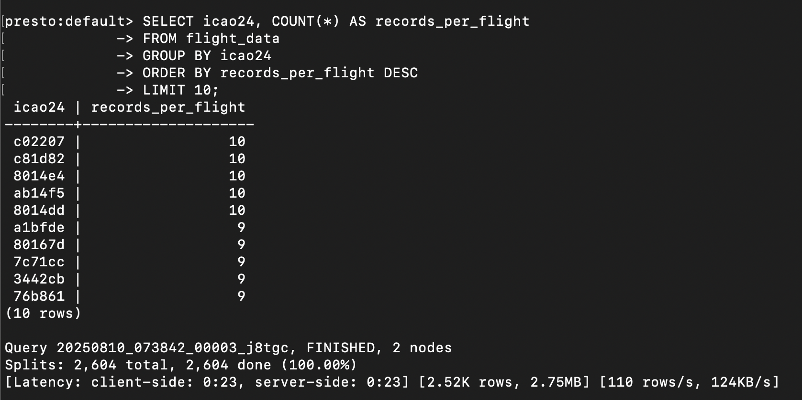
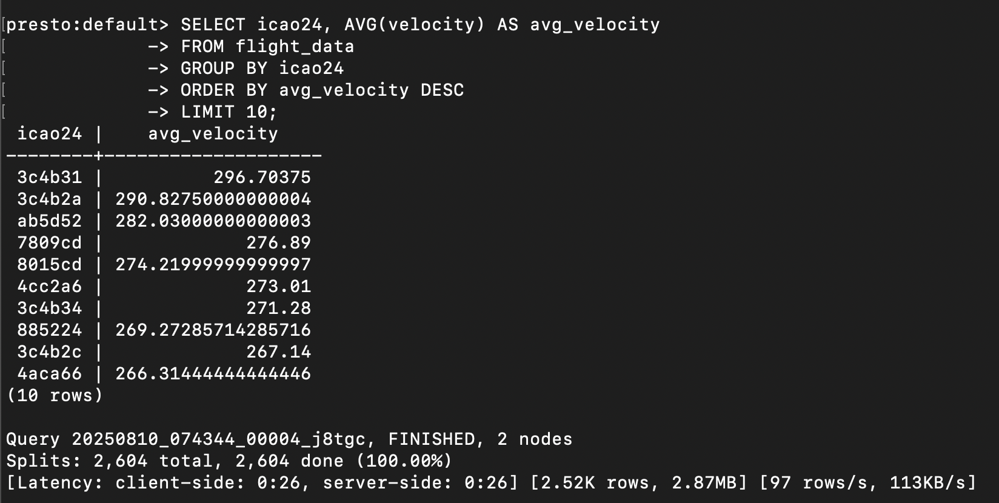
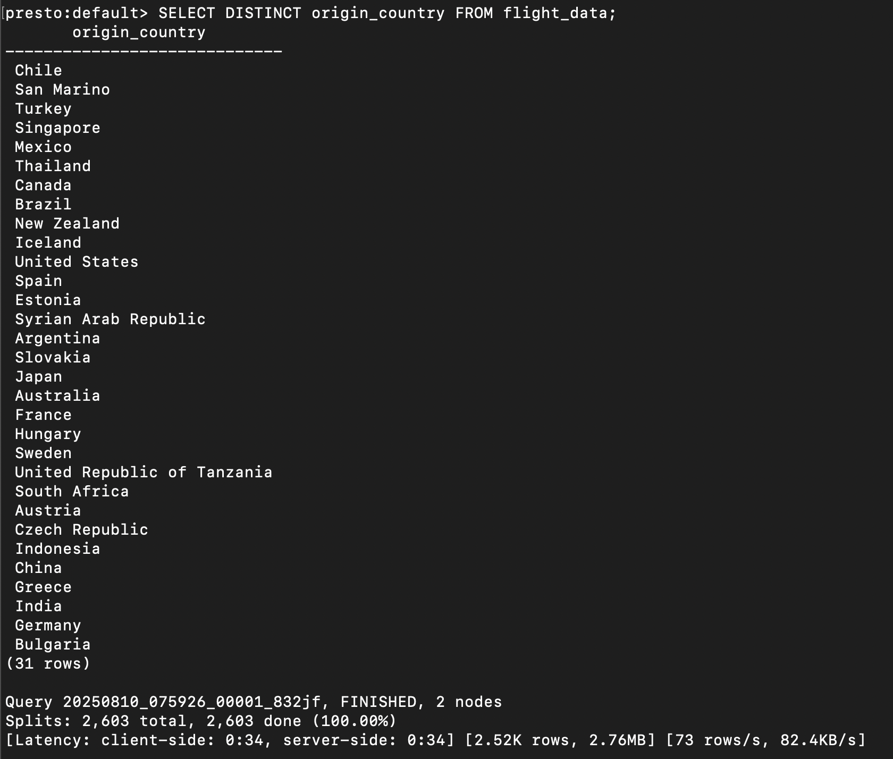
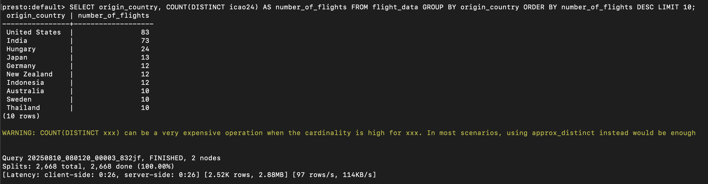

# Check Inserted Iceberg Data using Presto

We use `presto-cli` to test SQL `SELECT` statements

`presto-cli` is available in the coordinator pod. So, inside the coordinator, execute the below SQL statement.

```
kubectl exec -it presto-coordinator-599f45799f-d9k2v -n presto -- /bin/sh
```

```
cd /opt
```

```
./presto-cli --server localhost:8080 --catalog iceberg
```

```
USE iceberg.default;
```

Execute following queries to see the output:

Check Total Number of Rows

```
SELECT COUNT(*) FROM flight_data;
```



Preview Sample Data

```
SELECT * FROM flight_data LIMIT 10;
```



Count Records per Flight

```
SELECT icao24, COUNT(*) AS records_per_flight 
FROM flight_data
GROUP BY icao24
ORDER BY records_per_flight DESC
LIMIT 10;
```



Calculate Average velocity per Flight

```
SELECT icao24, AVG(velocity) AS avg_velocity
FROM flight_data
GROUP BY icao24
ORDER BY avg_velocity DESC
LIMIT 10;
```



Unique Origin Countries

```
SELECT DISTINCT origin_country FROM flight_data;
```



Count Number of Flights from Origin Country

```
SELECT origin_country, COUNT(DISTINCT icao24) AS number_of_flights
FROM flight_data
GROUP BY origin_country
ORDER BY number_of_flights DESC
LIMIT 10;
```

