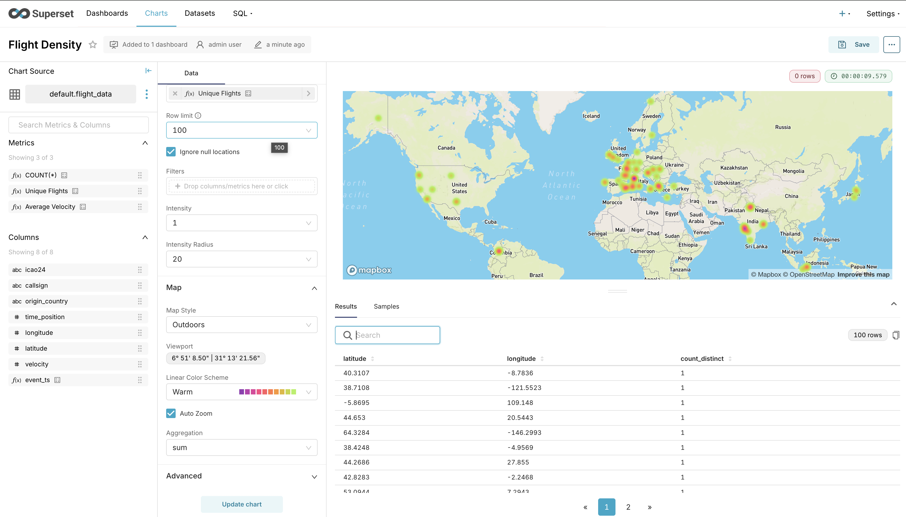

# Create Dataset 

Click `Create dataset and create chart`


Attach a chart. For now, let's start with a `Bar chart` and click on `Create`.

After that, edit the dataset to add a Calculated Column for timestamp.

SQL Expression

```
from_unixtime(time_position)
```

Label

```
event_ts
```

Data type

```
DATETIME
```


Finally, in the Metrics tab, add a new metric `COUNT(DISTINCT)`


Click `Save`.

# Bar Chart to display Unique Flights by Country

Drag and drop `origin_country` into X-axis box.

Click on the metrics box to add Custom SQL

```
COUNT(DISTINCT icao24)
```


Click `Save`. Fill other properties as shown.

Click `Create Chart`


Click `Save` to save the chart and create a new dashboard and save again.


# KPI to display the Average Velocity of All Flights

Select the `Big Number` chart and click `Create New Chart`


To get average, we need to another metric to the dataset.


Add the metric and Subheader.


Change the Number format in Customize Tab


Add to the dashboard by clicking on `Save`.


# Heat Map - Flight Density by latitude / longitude

Create a new chart named `deck.gl Heatmap`.


Attach `longitude` and `latitude` to corresponding columns.


Go to mapbox website and signup. Get the access token from mapbox.

Export it using below command.

```
Export MAPBOX_API_KEY = "your-api-key"
```

Restart the superset.

```
superset run -p 8088 --with-threads --reload --debugger
```



Add to the dashboard by clicking on save. The dashboard currently looks like below.


# Line Chart - Average Velocity Over time

Create a chart. Fill the properties as shown and click on `Create Chart`.


Add to the dashboard by clicking on `Save`. The final dashboard looks like below.


The Presto UI dashboard runs all 4 queries as shown below

